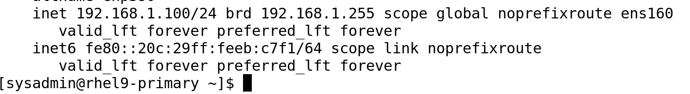
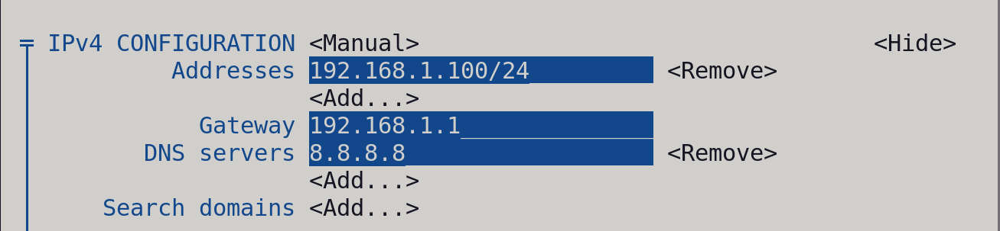
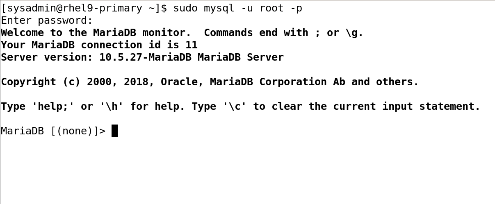
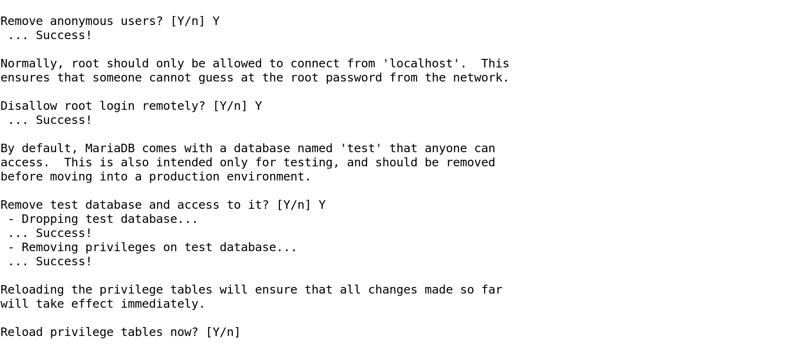
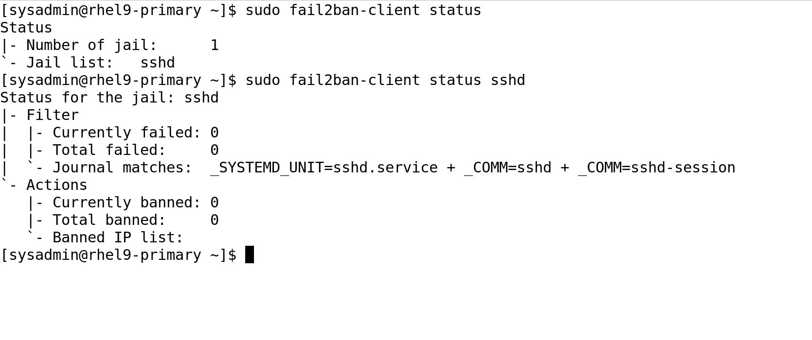
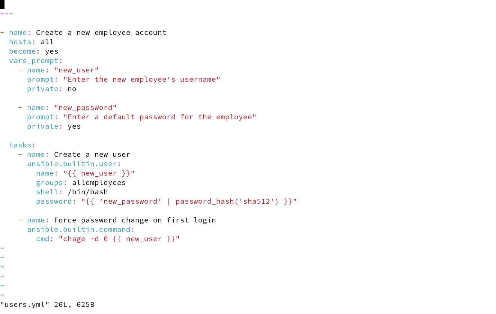
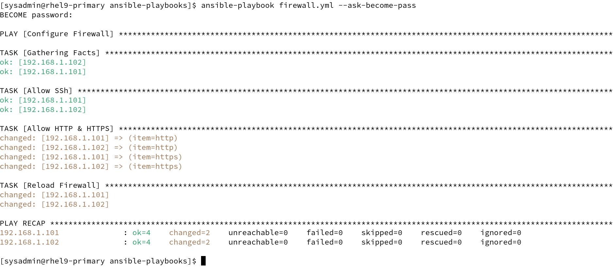
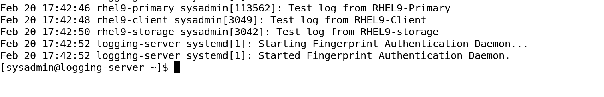

## 📂 Phase 1: Foundational Setup

- **Primary VM - IP Address Configuration (`ip a`)**  
  

- **Primary VM - `nmtui` Interface (Static IP Setup)**  
  

- **Primary VM - Disk Layout (`lsblk`)**  
  

- **LVM Storage Setup (`lsblk` showing additional storage volumes)**  
  

- **Firewall Rules - Allowed Services (`firewall-cmd --list-services`)**  
  

- **Successful SSH Login without Password**  
  

---
## 📂 Phase 2: Service Deployment

- **Apache Web Server - Test Page**  
  

- **MariaDB Connection Verification**  
  

- **MySQL Secure Installation Completed**  
  

- **NFS Mount Verification on Storage Server**  
  

- **TrueNAS NFS Settings**  
  

- **Automated Backup Configuration (`rsync` + `cronjob`)**  
  

---

## 📸 Phase 3 Screenshots Documentation

### 🔐 Security Hardening
- **SELinux Status Check**  
  

- **Fail2Ban Jail Status**  
  

### 👥 User Management
- **User Creation with Ansible**  
  

- **Forced Password Change on Login**  
  

### 🔥 Firewall & Security
- **Firewall Rules Configuration**  
  

### 📜 Centralized Logging
- **Logging Test Output**  
  

