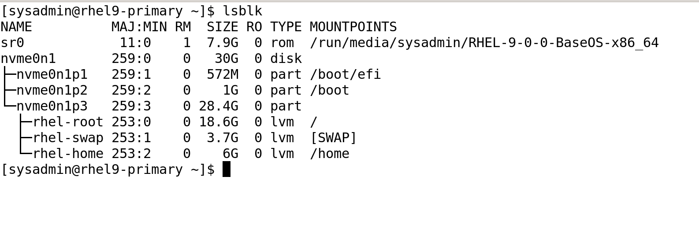
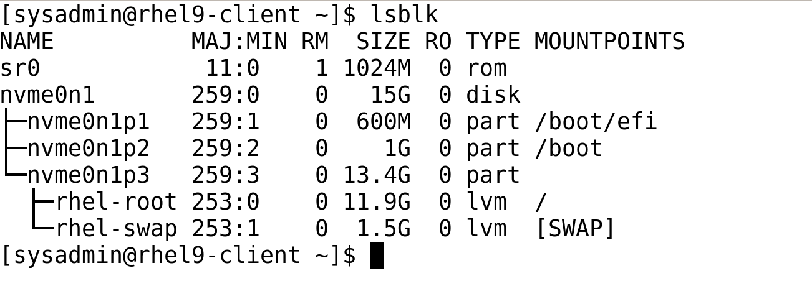
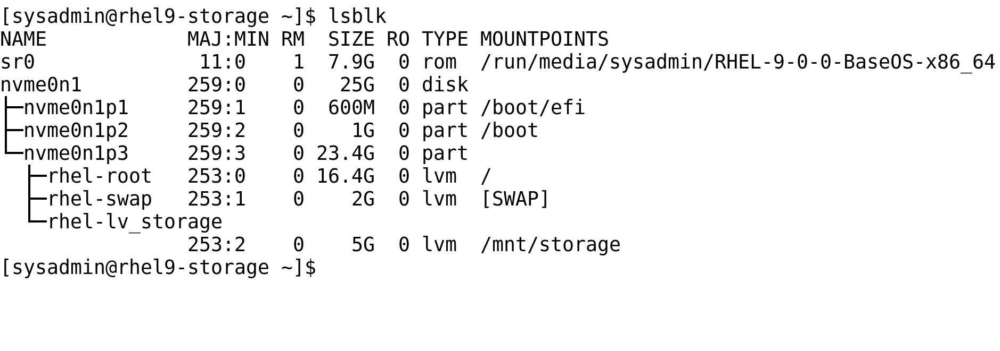
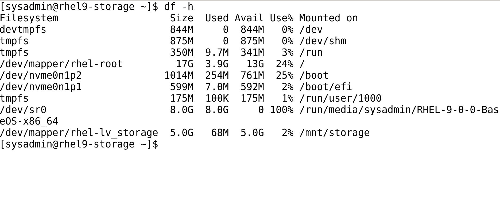

# 📸 Screenshots Documentation

This file contains all **Phase 1 screenshots** with descriptions.

---

## 1️⃣ Network Configuration
- **Primary VM - IP Address Configuration (`ip a`)**  
  

- **Primary VM - `nmtui` Interface (Static IP Setup)**  
  

---

## 2️⃣ Disk & Storage Configuration
- **Primary VM - Disk Layout (`lsblk`)**  
  

- **Client VM - Disk Layout (`lsblk`)**  
  

- **Storage VM - Disk Layout (`lsblk`)**  
  

- **LVM Storage Setup (`lsblk` showing additional storage volumes)**  
  

---

## 3️⃣ Network Connectivity Testing
- **Ping Test - Verifying VM Connectivity**  
  

---

## 4️⃣ Firewall Configuration
- **Firewall Rules - Allowed Services (`firewall-cmd --list-services`)**  
  

