# 📸  Phase 1 Screenshots Documentation

---

## 1️⃣ Network Configuration
- **Primary VM - IP Address Configuration (`ip a`)**  
  

- **Primary VM - `nmtui` Interface (Static IP Setup)**  
  

---

## 2️⃣ Disk & Storage Configuration
- **Primary VM - Disk Layout (`lsblk`)**  
  

- **Client VM - Disk Layout (`lsblk`)**  
  

- **Storage VM - Disk Layout (`lsblk`)**  
  

- **LVM Storage Setup (`lsblk` showing additional storage volumes)**  
  

---

## 3️⃣ Network Connectivity Testing
- **Ping Test - Verifying VM Connectivity**  
  

---

## 4️⃣ Firewall Configuration
- **Firewall Rules - Allowed Services (`firewall-cmd --list-services`)**  
  

## 5️⃣ SSH Key-Based Authentication
- **Successful SSH Login Without Password**  
  

# 📸 Phase 2 Screenshots Documentation

---

## 1️⃣ Apache Web Server Setup (Primary VM)
- **Apache Status**  
  
- **Firewall HTTP/HTTPS Rules**  
  

---

## 2️⃣ MariaDB Installation & Configuration (Primary VM)
- **MariaDB Connection Test**  
  
- **MariaDB Secure Installation**  
  

---

## 3️⃣ NFS Shared Storage Configuration (Storage VM & TrueNAS)
- **TrueNAS NFS Settings**  
  
- **Mounted NFS Storage**  
  

---

## 4️⃣ Automated Backup with `rsync` (Primary & Storage VMs)
- **Cronjob Setup (Primary VM)**  
  
- **Backup Files Verified on TrueNAS**  
  
- **Backup Files Verified on Storage VM**  
  

---

# 📸 Phase 3 Screenshots Documentation

This file contains all **Phase 3 screenshots** with descriptions.

---

## 🔥 Security Hardening

- **SELinux Status Verification (`sestatus`)**
  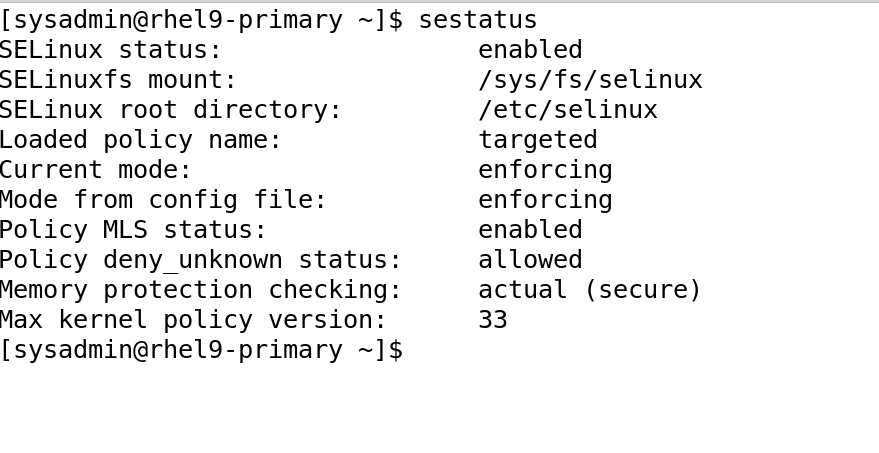

- **SELinux HTTP & HTTPS Policies**
  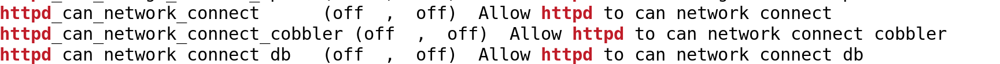
  

- **SSH Security Hardening**
  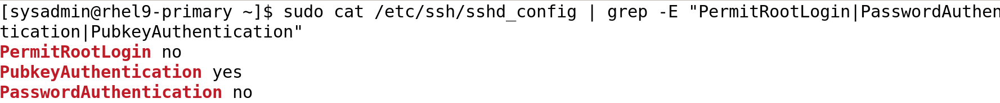

---

## 🔒 Fail2Ban Configuration

- **Fail2Ban Jail Config (`/etc/fail2ban/jail.local`)**
  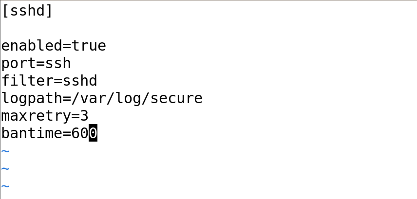

- **Fail2Ban Status (`fail2ban-client status sshd`)**
  

- **Auditd Logs for Failed Logins**
  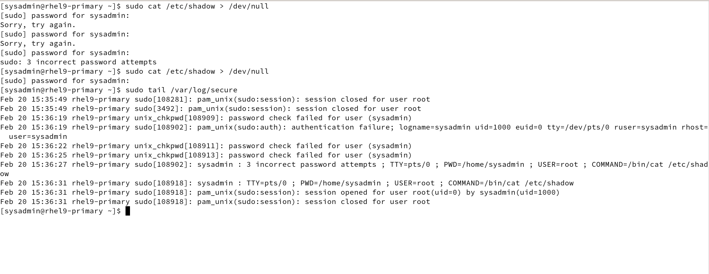

---

## ⚙️ Ansible Automation

- **Ansible Ping Test (`ansible all -m ping`)**
  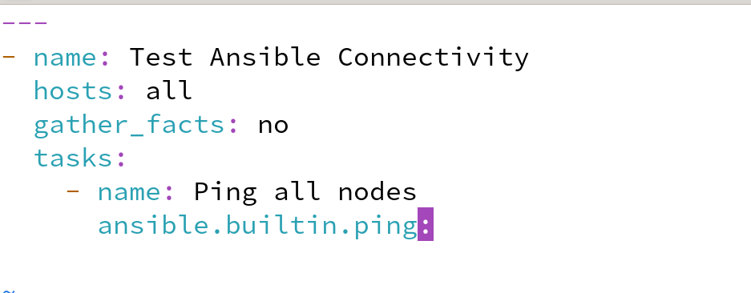

- **Ansible Playbook for Firewall**
  

- **Firewall Playbook Execution**
  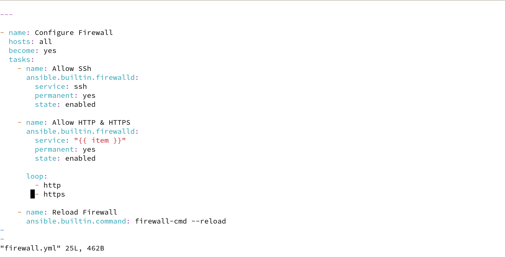

- **Ansible Playbook for User Management**
  

- **Ansible Playbook Execution for Users**
  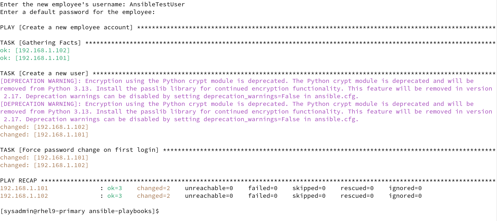

- **User Created via Ansible**
  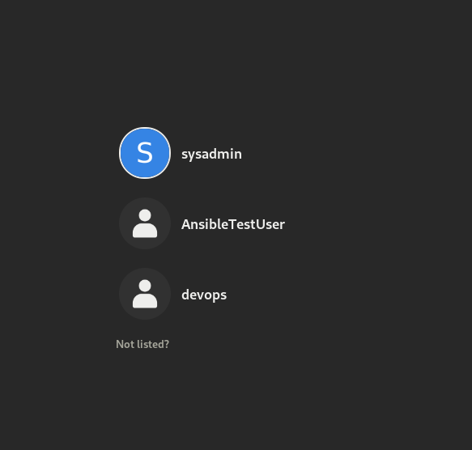

- **User Forced to Change Password at Login**
  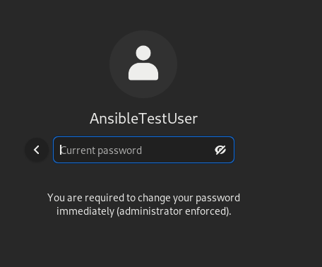

---

## 📜 Centralized Logging

- **Firewall Ports Open for Logging Server**
  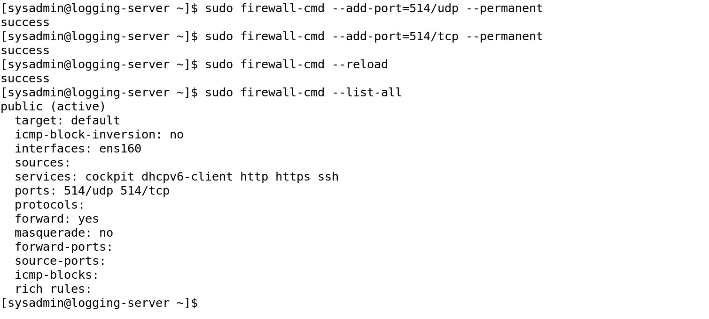

- **Logging Test Output**
  

